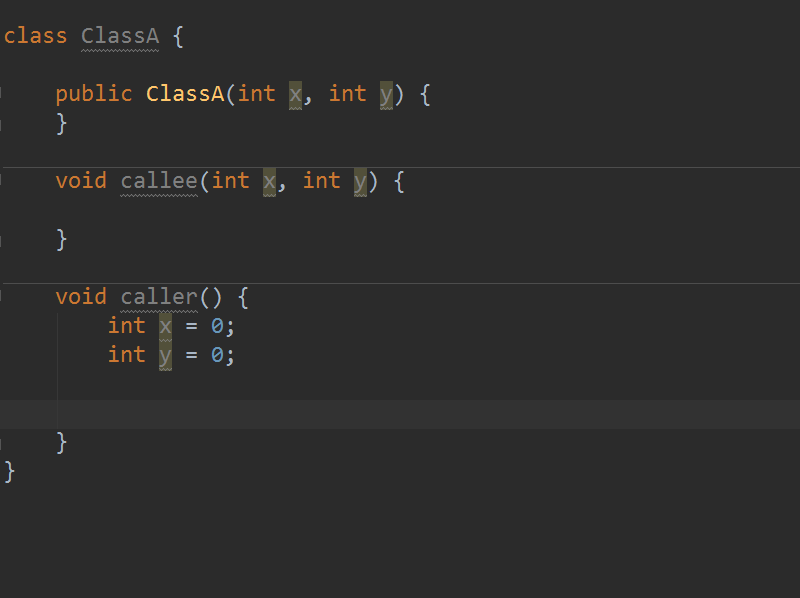

Auto filling Java call arguments
================================

This is an IntelliJ IDEA plugin. It guesses the call parameters by the callee parameter names.

Known limitations
-----------------
* takes one of the overloaded methods without asking which one

Licence
-------
Apache License Version 2.0, January 2004
